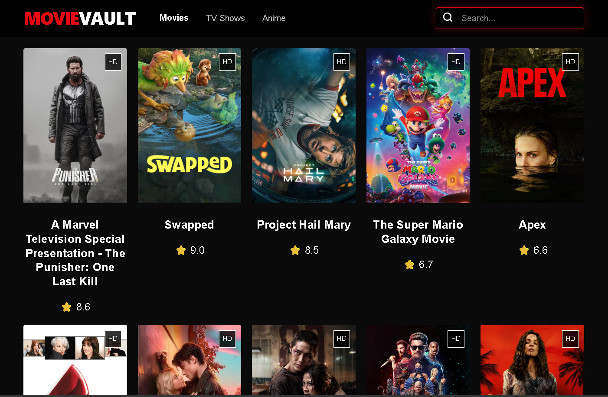
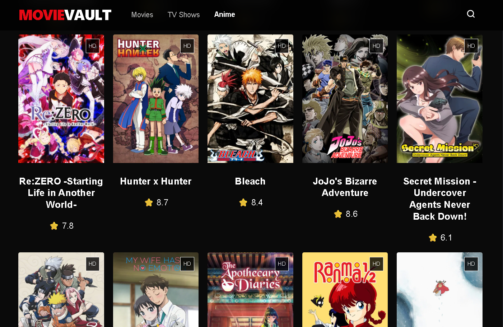

# 🎬 MovieVault
MovieVault is a high-performance, cinematic streaming dashboard built with React and Vite. Leveraging the TMDB API, it delivers a seamless discovery experience across Movies, TV Shows, and Anime with a focus on speed, responsiveness, and a "stunning" dark-mode aesthetic.

# 📸 ScreenShots

# 🚀 Technical Highlights
⚡ Lightning Fast: Powered by Vite for near-instant HMR (Hot Module Replacement) and optimized build times.

📺 Multi-Server Architecture: Dynamic iframe injection supporting VidLink, VidSrc, and 2Embed to ensure 99% stream availability.

🎞️ Netflix-Style UX: Custom-engineered horizontal episode scroller with "Now Playing" state management and automatic season fetching.

🛡️ Security Conscious: Implemented referrerPolicy="origin" and specific allow permission headers to maintain player stability while mitigating intrusive redirects.

📱 Universal UI: A fully responsive CSS Grid system that adapts flawlessly from desktop monitors to mobile touchscreens.

# 🛠️ Tech Stack
Core: React.js 18+

Build Tool: Vite

Data Source: TMDB (The Movie Database) API

Styling: Modern CSS3 (Custom Properties, Flexbox, Grid)

Icons: Hand-crafted SVG Vector Graphics

# ⚙️ Installation & Setup
Clone the Repository:
git clone https://github.com/naveen16004/movie.git

Install Dependencies:
npm install

Environment Configuration:
Open App.jsx and update the API_KEY constant with your personal TMDB API key.

Launch Development Server:
npm run dev

# 📜 License
Distributed under the MIT License. See LICENSE for more information.

# 🤝 Contact
Naveen - Computer Science Student & Developer GitHub: naveen16004

Project Link: https://github.com/naveen16004/movie
